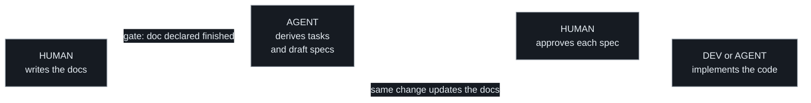

# WritRun

**What is written, runs.**

Autogen tasks and specs from your docs.   
Docs are the executable source. Code is the derived artefact.  
You write the doc. AI checks the code and generates the tasks and specs, ready for development.

---

> **Alpha.** Everything here — rules, schemas, statuses, workflows, even
> names — can still change without notice; nothing is stable to build on
> yet.

What it does:

- **Docs as the source of truth.** You write the rules in `docs/`; code
  is checked against them — never the reverse.
- **Autogen tasks and specs.** Tell your agent
  "update the tasks": it reads what you wrote, compares it to the actual
  project, and generates the tasks and specs that close the gap.
- **Who implements is your call, per task.** A generated task carries a
  complete brief, linked to a spec. Hand it to a developer on the team,
  or point an AI agent at it.
- **The queue mirrors into GitHub Issues.** Optional: every task appears
  as an Issue in real time, labels following the work on their own.
- **AI drives the commits and PRs** — from Stage 2, where git begins.
  Branches, conventional commits, PR bodies, checks in the right order —
  the agent conducts the queue mechanics, whoever writes the code.
  Stage 1 is the entry point and needs none of it: just the docs, the
  generated queue, and the gates — files alone.
- **Humans keep four named gates:** the docs, the handoff, the approval,
  the merge.

Underneath: a documentation methodology where docs are the executable
source and code is the derived artefact.

---

## The gap this fills

Two trends are colliding, and most teams are handling it badly:

- **AI agents increasingly write the code.** When that's true, the
  bottleneck moves upstream — to specification. Vague prompts produce vague
  code; precise, checkable documentation produces code an agent can be
  trusted to write with less supervision.
- **"Spec-driven development" is a crowded claim** without a shared
  definition of what "spec" means or how it relates to the rest of a
  project's documentation. Most implementations collapse product intent,
  technical design, and task tracking into one file trying to serve three
  audiences at once.

**Contribution becomes compute-bound, not context-bound.** A task that is
ready for development carries, by construction, a complete brief a human
already assented to — and the checks run for any fork, no secrets. Pointing
an agent at the queue and paying its tokens is a whole contribution;
curation stays human. Understanding the codebase stops being the price of
helping.

**And the footprint is deliberately small.** Adoption adds one
provenanced home (`.writrun/` — skills, scripts, templates, your
conventions), the queue (`work/`), four workflows where GitHub demands
them, and one fenced section grafted into your `AGENTS.md`. Nothing of
yours is touched: your docs keep their shape, your skills folder stays
yours, your PR template is never overwritten.

WritRun makes one split structural and non-negotiable — **nature**:
permanent state lives in `docs/`, work in progress lives in `work/`, so
"what does this do" and "what should I do next" are never read from the
same folder. The **audience** split (business vs. engineering) is a rule
about files — product intent and technical design never share one — while
the shape of `docs/` itself belongs to the project's stakeholders: the
machinery prescribes nothing inside it, and everything under it is the
input tasks are created from.

## The pipeline

Everything starts at the permanent docs: human-written, human-reviewed —
the input, never the output. A task is the request; its spec is the
elaboration; code is the derived artefact. Whoever picks up a spec — a
developer on the team or an AI agent — gets the same brief a human would
have written by hand, session after session, without the project being
re-explained from scratch.

**The loop back is the part most spec-driven workflows leave out.** A
spec names, up front, every permanent doc the finished change will touch;
the diff that completes the task must touch all of them and nothing else.
That closing loop is what makes the docs stay true after the agent is done
— it is checked mechanically, not remembered.

How the pipeline actually runs — step by step, with every actor named —
is the five flows and their special cases, drawn in full in
[Pipeline](docs/product/stage-1-tasks-and-specs/README.md): **the flows
there are the source of truth for the mechanics**, on the permanent
side of the repository, where the checks that keep docs honest can see
them. The human gates sit where the flows draw them: a rule declared
finished (flow 1), a spec approved by review (flow 2), every merge a
maintainer performs (flows 2 and 5) — and behind them all, a permanent
doc never merges on agent approval alone.

The sketch, one line per flow — flow 1 is Stage 1's whole pipeline;
flows 2–5 describe the queue riding the forge, which begins at Stage 2:

1. **Authoring** — a human writes a rule in `docs/` and declares it
   finished (a gate); the agent derives tasks and draft specs — and,
   from Stage 2, opens the PR, the mirroring Issue appearing on its
   own.
2. **Approval** — the maintainer's review is the gate; CI records
   `draft → approved` onto the branch; merge makes the task ready.
3. **Taking a task** — an agent takes the next by the algorithm; a human
   picks any eligible one. `blocked`, an open dependency, or a draft
   spec excludes a task for everyone. The draft PR is the signal: the
   bot answers it by writing `in-progress` onto `main` itself.
4. **Finishing** — work done → delta check → Outcome, spec status and
   the `completed` date → state check → ready for review; the two
   checks sit on either side of the status change, in that order,
   always. The merge is what flips the task `done` on `main`.
5. **Review and merge** — CI re-runs the checks (methodology, not code);
   the maintainer squash-merges; the Issue mirror follows.

Special flows — a spec amended after approval returns through `draft`
and is re-approved; work discovered mid-flight enters as a `queue/` PR
adding only task and spec; `blocked` names its reason and waits for a
human; a PR closed unmerged is unwound by the bot — its task returns to
`ready` on `main` on its own, because nothing else was ever
reserved — same gates, drawn separately in
[the same chapter](docs/product/stage-1-tasks-and-specs/conflicts.md).

## Three stages

Adoption is progressive: three stages, each adding machinery on top of
the one before and changing nothing beneath. A project declares its
stage in `.writrun/settings.json` (`stage: 1`, `2` or `3`);
everything that belongs to exactly one stage carries a `stage-N-`
prefix in its name. The full rules live in
[Adoption](docs/product/adoption.md).

| Stage | Does | Requires |
|---|---|---|
| **1 — tasks and specs** | Autogen tasks and specs from your docs, as markdown files. | Nothing — files only. |
| **2 — pull requests** | Git begins: commits, branches, PRs, the CI checks, merge as assent. The bot owns the queue's status lines on `main`. | `git` + a GitHub repo · Actions permissions **Read and write** · `main` reachable by the Actions bot |
| **3 — GitHub issues** | Every task mirrored as an Issue, its `status:` label live. | Issues enabled — nothing else; Stage 2's permission already covers the labels. |

## Repository setup

No secrets, no App token, no PAT. Labels are created on first use.

| Where | Setting | Value |
|---|---|---|
| Settings → General | Issues | **On** — the task mirror lives there. Skip if you deleted the two mirror workflows. |
| Settings → General | Allow squash merging | **On** — every merge is a squash. |
| Settings → Actions → General | Workflow permissions | **Read and write** — lets `writrun approve` record `draft → approved`. Read-only loses only that convenience; every check still works. |
| Settings → Rules → Rulesets → ruleset on `main` | Block force pushes · Restrict deletions | **On** — safe on any repo: the machinery's recording pushes are ordinary pushes and are unaffected. |
| Settings → Rules → Rulesets → same ruleset | Require a pull request + the GitHub Actions app on the bypass list | **Recommended, never a condition for adoption.** The bypass is what lets the recording commits (status flips, dates, approvals) keep landing on `main`. The forge only offers the app as a bypass actor on organization-owned repos — on user-owned repos (UI and API alike) it is unavailable, so skip this rule there; everything human still enters through a PR by convention. Approvals: 1 with reviewers; 0 where the maintainer authors the PRs — there the merge is the assent. |
| Settings → Rules → Rulesets → same ruleset | Dismiss stale pull request approvals | **Off** — the recording push would dismiss the approval it records. Only relevant with the PR rule above. |
| Settings → Rules → Rulesets → same ruleset | Required status checks | Optional: the four `writrun check` jobs. If required, keep the repository's administrators on the bypass list ([why](docs/technical/decisions/README.md)). |

For this repository itself (not adopters): Settings → General →
Description = `What is written, runs. Autogen tasks and specs from your
docs.`

Local tooling — the scripts' only dependencies:

| Tool | Needed for |
|---|---|
| `git`, `bash`, POSIX `awk`/`sed` | Everything — skills, checks, test suite. No other runtime, ever. |
| `gh`, authenticated | `make release` (aborts untouched without it) and `list_tasks.sh`'s in-flight signal (degrades to files-only, with a warning). |
| Push access to `main` | `make release` — tags are cut from `main`, locally. |

## Principles

1. **Docs are the input, not the output.** Code is checked against
   documentation, not the other way around.
2. **Audience split is structural, not stylistic.** Product and technical
   docs are different files, for different readers, never sections of one.
3. **Permanent and ephemeral never mix.** A finished spec is history, not
   documentation of the present.
4. **Identity is never order.** An id is permanent; priority and sequencing
   live in mutable fields.
5. **No drift by construction, not by discipline.** A completed change
   updates the permanent docs in the same change — enforced by a checklist,
   not left to whoever remembers.
6. **Trivial work stays out of the system.** A typo is a commit, not a task.
7. **Human gates are explicit, not implied.** Every point where a human must
   approve is named in `AGENTS.md`, never assumed.

Full pitch, personas, and non-goals in [`docs/about.md`](docs/about.md).

## Documentation

Everything relevant lives in [`docs/`](docs):

|  |  |
|---|---|
| [About](docs/about.md) | What this project is, who it's for, and what it refuses to become |
| [Product](docs/product/README.md) | What the methodology prescribes, rule by rule — read in order, like a book |
| [Technical](docs/technical/README.md) | Schemas, the task selection algorithm, and how the skills are distributed |
| [Decisions](docs/technical/decisions/README.md) | The dated why behind each piece of machinery, and what was rejected |
| [Tasks](work/tasks/README.md) | This project's own queue — it dogfoods itself |
| [Specs](work/specs/README.md) | The detail of each change made to this repo |
| [Skills](.writrun/skills) | `writrun-select-next-task`, `writrun-create-task-and-spec`, `writrun-check-spec-deltas`, `writrun-check-task-state` — installed into an adopting project's own `.writrun/skills/` |
| [Contributing](CONTRIBUTING.md) | How work is defined in tasks and specs, and what a PR is checked against |
| [Conventions](.writrun/conventions/README.md) | Commit, branch, PR, task, and spec conventions — shipped as defaults, the project's to edit |
| [Template](template/WRITRUN.md) | The adoption kit, shaped like the destination root — its guide travels with the copy as `WRITRUN.md` |

## Status

`docs/product/` chapters exist and are internally consistent, extracted
from swoop (a mature, fully-designed but never-executed pipeline) and TOM
(a partial, structurally divergent adoption) — see
[Adoption](docs/product/adoption.md) for what "partial" means concretely.
Neither project has been migrated to consume this repo yet; that is the
next milestone for each, separately.

That gap already cost something: a review before the first commit found the
check had a fatal path-prefix bug and could never have passed — see the
dated entry in [Technical](docs/technical/decisions/README.md). The same
review corrected the pipeline diagram above, which had ended at the agent
rather than the code and left out the loop back to the permanent docs. Both
went straight into the docs without a task or a spec, this once, since
there is no history yet to keep honest. From the first commit on, changes
of that size go through the pipeline like everything else.

## Why "WritRun"

A **writ**, in its oldest sense, is simply *the written* — from Old English
*wrītan*, "to write." In law it narrowed to something more specific: a
formal written instrument that compels an act. No writ, no remedy — the
writ was the document that both authorized and bounded the action that
followed it. That is the exact relationship this methodology assigns to
documentation: a human writes the doc, and everything downstream — the
task, the spec, the code — exists only because the doc authorized and
bounded it. **Run** is the other half: the doc doesn't just sit as
reference, it executes, driving agents through the pipeline without being
re-explained every session.

## License

[MIT-0](LICENSE) — MIT with no attribution requirement: use it, modify it,
ship it, with nothing to preserve and no notice to carry. See
[CONTRIBUTING.md](CONTRIBUTING.md) for the reasoning.
