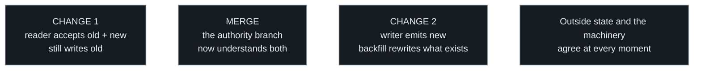

# Migrating state the forge holds

The mirror is the only thing WritRun writes outside the repository, which
makes it the only thing that cannot move atomically with a diff. This is
the order that keeps the two in step.

## A change migrates state outside the repository

Some changes have to rewrite state that does not live in the repository —
a mirror's title, its labels, anything the forge holds. That state has no
branch, so it cannot move with the diff that understands it, and the
ordering that is free everywhere else becomes a decision here.

**The machinery that reads outside state runs the authority branch's
copy, not the pull request's.** That is deliberate — a workflow with
write access must never execute a contributor's code — and it has a
consequence: outside state written in a new shape is unreadable until the
reader that understands it has *merged*. Write first and the gap between
the two is a window where the machinery cannot find what it just renamed.

So the migration lands in two changes, in this order:

1. **The reader**, taught to accept the old shape and the new one, and
   still writing the old. Merging it is what puts the tolerant reader on
   the authority branch.
2. **The writer and the backfill**, once the reader is there.

The old shape stays readable afterwards. Dropping it is a third change,
and only worth making when nothing outside is left in the old shape —
until then a reader that has forgotten it does not report a miss, it
mints a duplicate for something that already exists.

A single change that does both is not wrong in its result — it is wrong
in its window. The repository moves atomically at the merge; the forge
moved whenever the change's author ran the backfill, and the two are the
same instant only by luck.

That window has a second edge, and it opens *after* the backfill has run.
Until the writer merges, the authority branch still **mints** the old
shape — so anything the machinery creates in the meantime is born stale,
behind a backfill that already passed it. A migration is therefore not
finished by its backfill; it is finished by its merge. Running the
backfill second, as the order above puts it, is what leaves nothing to be
born into.

## Criteria

- A change that rewrites outside state ships as two changes, reader first.
- The reader accepts the old shape and the new one before any writer emits
  the new one.
- The backfill runs in the writer's change, never ahead of the reader's
  merge.
