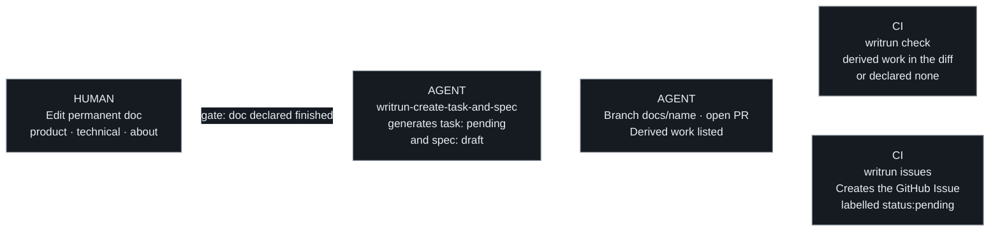
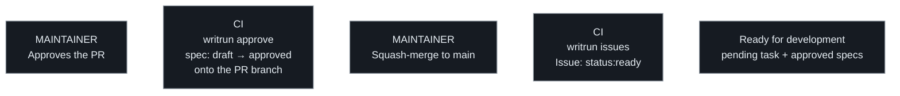
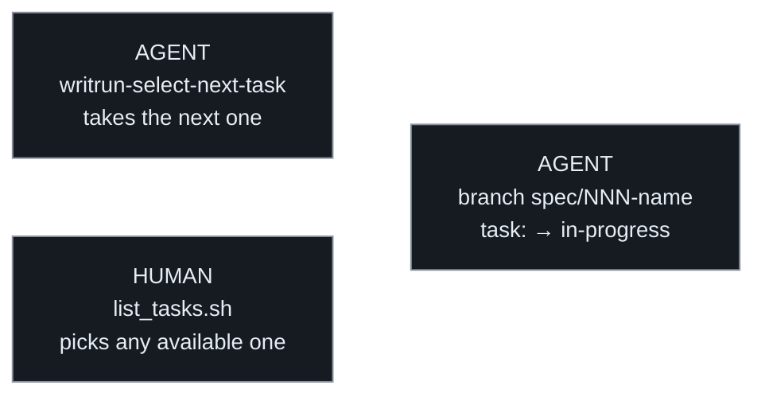
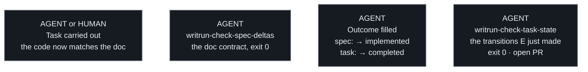
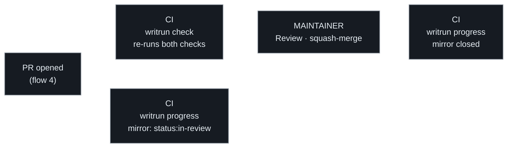
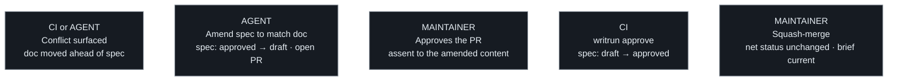
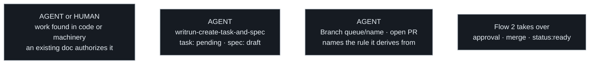
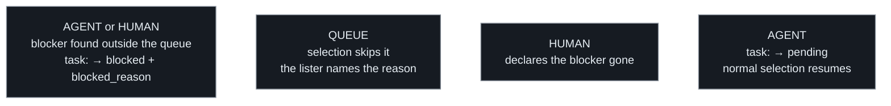
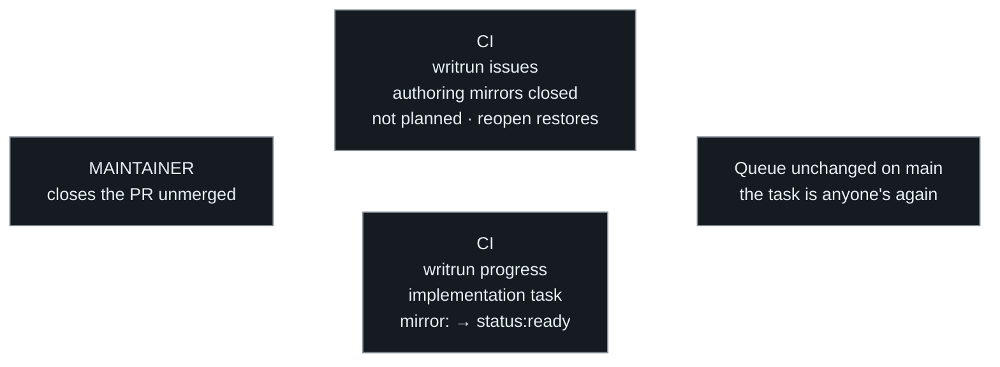

# Pipeline

```
       authoring
docs (human) → task (request) → spec (elaboration) → code (derived)
      ↑                                                    │
      └──────────── loop closure, same change ─────────────┘
```

Permanent documentation is written by a human, with human review. Everything
downstream of it is derived: the queue mechanics are agent work, and the
implementation goes to whoever takes the task — a developer or an agent,
same flow (flows 3 and 4). All of it is gated at specific, named points — never
gated by implication, never left to whoever is doing the work that day to
decide whether a checkpoint applies.

It is a loop, not a line. The last step feeds the first: a completed change
updates the permanent docs it was derived from, in the same change that
ships the behaviour. A pipeline that only runs forward produces docs that
were true once.

## The flow

1. **Docs** — [a product doc](concepts/product-doc.md) or [a technical
   doc](concepts/technical-doc.md) states what should be true. These two are
   the input the rest of the pipeline works from, not a record of what was
   already built. Writing a rule here is **authoring**, described below.
   [About](concepts/about.md) sits alongside them as the shared context
   every reader starts from — it is permanent, and a change to it goes
   through this same pipeline, but no task originates from it: About says
   what the project *is*, and work originates from what the system *does*
   or *how it is built*.
2. **Task** — an agent (or a human) that finds work not yet tracked creates
   its [task](concepts/task.md) first. A task never follows its own spec
   into existence.
3. **Spec** — a [spec](concepts/spec.md) elaborates one task: scope, steps,
   acceptance criteria, and the Proposed-changes contract that names every
   permanent doc the completed work will touch.
4. **Code** — the derived artefact. It exists because a doc authorized it
   and a spec bounded it — never the other way around, and never without
   either.
5. **Back to the docs** — the same change that ships the code updates every
   permanent doc the spec's Proposed-changes sections named, and no other.
   This is **loop closure**, and it is the step that stops the input from
   going stale: without it, step 1 describes a system that no longer
   exists. Mechanically checked, not remembered — see
   [`writrun-check-spec-deltas`](../../.writrun/skills/writrun-check-spec-deltas/SKILL.md).

## Flows and statuses

How the pipeline actually runs — step by step, with every actor named —
is the flows below, and **the flows are the source of truth for the
mechanics**. The human gates sit where the flows draw them: a rule
declared finished (flow 1), a spec approved by review (flow 2), every
merge a maintainer performs (flows 2 and 5) — and behind them all, a
permanent doc never merges on agent approval alone; the gates are named
in full in [Human gates](#human-gates).

**Statuses.** These values and no others.

| | Values | Moved by |
|---|---|---|
| Task | `pending` → `in-progress` → `completed`, or `blocked` (needs `blocked_reason`) | whoever does the work |
| Spec | `draft` → `approved` → `implemented` | `approved` by a human only; the rest by whoever does the work |

Two states are **derived, never stored**: *ready for development* is a
`pending` task whose every spec is `approved`; *waiting for review* is an
open PR. No field records either.

**Task is WritRun's noun; a GitHub Issue is only where a task is mirrored**
for people who read the queue in a browser. The file under `work/tasks/` is
the authority, always — an edit made in the mirror is not written back. In a
repository that also uses Issues for bug reports and feature requests, the
`writrun:task` label is what separates mirrors from everything else: every
workflow filters on it and touches nothing without it.

Each node names who acts. Only the human ones are decisions.

### Flow 1 — Authoring

A rule is written before anything implements it. **The human writes the rule
and nothing else** — the tasks and specs it derives are generated, the
branch and the PR are opened for them, and the mirroring Issue appears on
its own. Everything below the rule is derived, which is the whole claim this
methodology makes.

One thing no event can detect is that the rule is *finished*. A human writes
a rule over many edits and nothing distinguishes the last one, so the
handoff is an explicit signal, not an inference: invoking
`writrun-create-task-and-spec` — or marking the authoring PR ready for review — is
the human declaring the doc done. A forgotten handoff is caught
mechanically: `writrun check` fails any PR that changes a permanent doc
without either adding the tasks it derives or declaring "Derived work:
none" in the PR body.



### Flow 2 — Approval

The only flow the maintainer drives. Their review *is* the human gate —
everything after it is recorded, not decided.



### Flow 3 — Taking a task

Two ways in, same queue. **An agent takes the next task**, by the algorithm,
so repeated sessions agree without re-deriving an answer. **A person lists
what is available and picks** — order is a suggestion for them, and taking a
lower-priority task bypasses nothing. What neither can do is take a task the
filters exclude: `blocked`, a dependency still open, a spec still `draft`.

**Nothing reserves a task, and that is deliberate.** Reserving work is a
tracker's job, not this methodology's — WritRun's own non-goals say so. The
`in-progress` status is written on the branch and reaches `main` only at
merge — normally as `completed` already, though a merge that implements
one spec of several does land the task there still `in-progress`, where
the lister surfaces it as work to resume. Either way the queue files
cannot warn anyone in time to reserve anything. What `list_tasks.sh` can see is work in
flight: an open pull request for a task. Not a lock, but the one real-time signal a
forge can be asked for — and without network access it says so rather than
reporting a task as free.



### Flow 4 — Finishing a task

The work itself, then the loop. A task derived from an authored rule exists
to bring the **code up to a doc that already states it** — there is nothing
to update, and its spec promises no product change. A task that originated
elsewhere, in the code or the machinery, carries its doc change with it.

The agent drives the queue mechanics throughout — status, Outcome, the local
checks — because it is what holds the algorithm. **Only the work itself is
delegable.**

The two checks sit on either side of the status change, and that order is
load-bearing. `writrun-check-spec-deltas` verifies the doc contract and can run as
soon as the work is done. `writrun-check-task-state` has nothing to read until the
statuses move — every rule it has is about a transition, so running it first
passes without checking anything.



### Flow 5 — Review and merge

Everything after the pull request opens. The maintainer's review is the
decision; CI records around it — the same shape as flow 2.

CI re-runs both checks on the PR. **They verify the methodology, not the
code** — that the diff touched every doc the spec promised and no other,
and that no status moved through a gate it should not have. Whether the
code works is the adopting project's own pipeline's answer; WritRun does
not duplicate it or stand in for it.

The mirror follows the PR: `status:in-review` while it is open, closed once
a merge carries the task to `completed`. **`in-review` is a label of its own
rather than part of `in-progress`** because the two ask opposite things of
the maintainer — one means leave the worker alone, the other means the
maintainer is the blocker.



## Special flows

Flows 1–5 are the happy path. Special flows are the edge cases reality
produces — same gates, drawn separately.

### A spec changes after its approval

**Content under an approval never changes silently.** An approved spec's
body is what a human assented to; whatever the reason it must change —
usually the doc moved ahead of it (a later authoring change edited a
section it derives from), sometimes the elaboration was simply wrong —
the amendment goes through `draft` and passes the gate again. The doc
always wins over the spec. Two places catch the stale case: CI names the
affected tasks on the authoring PR itself (`writrun check`, queue
impact), and the selection algorithm's step 7 reads the doc against the
spec before any code.



### Work discovered mid-flight

Not every task descends from a fresh rule. Work found in the code or the
machinery — already authorized by a doc that exists — is **tracked**: a
change that only adds task and spec, touches no permanent doc, and
implements nothing. The third kind of change, next to authoring and
implementing (`AGENTS.md`). Its branch prefix is `queue/` on purpose: a
tracking PR records work, it is not working it, and must not read as in
flight.



### A task hits an outside blocker

`depends_on` resolves itself; `blocked` never does — it names something
outside the queue, and only a human decision brings the task back.



### The pull request dies

The unhappy half of review: closed without merging. Nothing was reserved,
so nothing needs releasing — the queue on `main` never changed.



A change belongs to flow 1, to flows 3–5, or to one special flow — never
more than one. One that closes the loop on one rule while introducing
another is two changes.

## Two ways a permanent doc changes

A permanent doc changes at two points in the loop, and they are not the
same act. Confusing them is how a project ends up either unable to write
down a decision it has just made, or shipping behaviour its docs never
mention.

- **Authoring** (step 1) — someone decides a rule that is not yet true
  anywhere and writes it down. The doc is the input: the work to satisfy it
  derives *from* the doc, and no task precedes the change. This is the only
  point where a permanent doc moves ahead of the system it describes.
- **Loop closure** (step 5) — a completed task updates the doc it derived
  from, in the same change that ships the behaviour, bounded by its spec's
  **Proposed changes** contract.

What separates them is direction, not size. Authoring states something the
system does not do yet; loop closure records something it now does. A single
change that tries to be both — closing the loop on one rule while quietly
introducing another — is two changes, and is split into two.

**Authoring closes the loop in advance, and the derived task must not close
it twice.** A task that exists because a rule was authored is there to bring
the code up to a doc that already states the rule. Its spec's **Proposed
product changes** is legitimately "none" — not an omission, and not a gap in
the contract: the doc was updated first, which is what authoring *is*. Loop
closure is for the other kind of task, the one that originated in the code
or the machinery, where no doc has said yet what the system now does. An
agent that "helpfully" re-edits a chapter the authoring change already wrote
is re-deciding a rule it was given, and the delta check will reject the
change as undeclared.

**Both modes leave the doc in the present tense.** A permanent doc is never
a plan and never a changelog, in either direction. Authoring writes the rule
as a rule, not as an intention: the doc says what the system does, and the
[task queue](concepts/task.md) is what records that the system has not
caught up yet. That separation is the whole reason a doc can lead
implementation without becoming a roadmap — the gap lives in the queue,
where it is tracked and closed, rather than in the prose, where it would
quietly become permanent.

Neither mode is exempt from review: a permanent doc never merges on agent
approval alone, whichever direction it changed in.

## Declaring derived work

An authoring change names every task and spec derived from it, in the
change itself.

Approving a rule is approving the work that rule commits the project to. A
reviewer shown only the new prose is being asked to decide half of
something — the sentence is cheap to agree with, and the queue it creates is
where the cost actually lands. Naming both in one place is what makes the
decision reviewable as one decision.

An authoring change that derives no work — a clarification, a rewording, a
rule the system already satisfies — states that explicitly. An empty
declaration and a forgotten one look identical otherwise.

The declaration is what was known at review time, not a closed set. Work
discovered later is tracked normally, against the rule it derives from; the
list is not a claim that nothing else will follow.

## Human gates

Four checkpoints are named, not implied. An adopting project states, in
its own `AGENTS.md`, who operates each one — but every adopting project
must name all four somewhere, even if the answer for one of them is "an
agent, autonomously":

- **Changing a permanent doc** — About, any product chapter, any technical
  section, authored or closing the loop. A human writes it or reviews it
  before the change stands. An agent may draft the change; a permanent doc
  never merges on agent approval alone.
- **An authored rule declared finished.** A human writes a rule over many
  edits and no event marks the last one, so derivation never starts on an
  inference: the human declares the doc done, and only then is the derived
  work generated. Today the declaration is simply telling the agent — or
  marking the authoring change ready for review; tooling may give it a
  command later. The forgotten handoff is caught mechanically, not
  remembered: a change to a permanent doc that neither derives tasks nor
  declares "none" does not merge.
- **A spec's `draft → approved` transition.** By default, human-only. An
  agent never self-approves a spec it drafted, or anyone else's, unless the
  adopting project has explicitly written down that it delegates this gate.
  `approved → implemented` is not gated the same way — it happens
  mechanically when the task completes and the Outcome section is filled.
- **A task whose brief is insufficient.** When `spec_ref` is empty and the
  task's own body plus `doc_ref` don't add up to a brief an agent could
  implement without guessing, the agent stops and asks whether to draft a
  spec first — it does not improvise scope to keep moving.

What a gate requires is a **human decision, recorded** — not a human
keystroke on a particular field. A project may record assent however it
likes, including by having its tooling write the transition once a person
has approved the change that carries it. What stays forbidden is the thing
the gate exists to prevent: a spec reaching `approved`, or a permanent doc
reaching `main`, with no person having assented to it at all.

Everything else in the pipeline — creating tasks, drafting specs,
implementing an approved spec, filling a spec's Outcome — is agent work,
autonomously, by default. Implementing is also the one step equally a
person's to take (flow 4); the gates do not change with who takes it.

## When the doc moves ahead of the queue

A task, its spec, and the rule they derive from are approved together —
they start consistent by construction. They stop being consistent one way
only: a **later** authoring change edits a section the queue still
references. That is allowed — the doc is the input and moves first; the
queue is what adjusts. Three consequences, in order:

- **The doc wins.** An approved spec whose premise the doc has since
  changed is no longer authorized work: its approval assented to a brief
  that no longer matches the rule. Implementing the spec as written ships
  code the doc contradicts; quietly "fixing" the work against the doc
  ships something nobody assented to. Neither is the agent's call — stop
  and surface the conflict.
- **The remedy is an amendment, through draft.** The spec is edited to
  reflect the current doc and returns to `draft` in the same change; the
  amended content then passes the same `draft → approved` gate as any
  spec. Editing an approved spec's body while it stays `approved` is
  forbidden — content under an approval never changes silently.
- **Staleness is caught where it is born.** The authoring change that
  moves a doc ahead of the queue is the moment the conflict comes into
  existence, and the reviewer of that change is already looking at the
  rule — so the machinery surfaces the overlap there: a change to a
  permanent doc that non-completed tasks reference names those tasks to
  its reviewer.

## Criteria

- When a rule is authored into a permanent doc, the change shall not
  require a task to precede it.
- When a rule is being authored, no task or spec shall be derived from it
  until a human has declared the rule finished.
- When a permanent doc is authored ahead of the system it describes, the
  doc shall state the rule in the present tense, and the gap shall be
  recorded as a task rather than as prose in the doc.
- When a change authors a rule into a permanent doc, that change shall name
  every task and spec derived from it, or state explicitly that none were.
- When a change would both close the loop on one rule and author another,
  it shall be split into two changes.
- When a task's `spec_ref` is empty and its body plus `doc_ref` do not
  amount to a sufficient brief, the agent shall stop and ask whether to
  draft a spec, rather than guessing at scope.
- When a spec transitions from `draft` to `approved`, a human shall have
  assented to that transition, whether or not a person writes the field.
- When a permanent doc (About, a product chapter, a technical section) is
  changed, the change shall not be treated as final until a human has
  written or reviewed it.
- When a task completes, its diff shall touch every path listed in its
  spec's Proposed-changes sections in the same change, and shall not touch
  a permanent doc that isn't listed there.
- When an approved spec conflicts with the permanent doc it derives from,
  the agent shall stop and surface the conflict rather than implement
  either side.
- When an approved spec's content needs to change, the change shall return
  it to draft, and the amended spec shall pass the approval gate again.
- When a change edits a permanent doc that a non-completed task
  references, the machinery shall surface the overlap to the change's
  reviewer.
