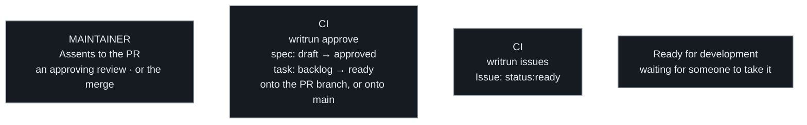

# Flow 2 — Approval

The only flow the maintainer drives. Their **assent** *is* the human gate —
everything after it is recorded, not decided.

**Which act carries the assent is the project's to name**, in its
`AGENTS.md`, because the forge decides what is even available. An
approving review is the richer signal and the default. A repository whose
maintainer authors its pull requests cannot use it at all — no forge lets
a person approve their own — and there the **merge** is the assenting act.
That is not the weaker gate it looks like: whoever may merge is exactly
whoever may approve, so the same person is deciding the same thing. What
changes is only where the recording can land, which the project's
machinery has to match — the PR's own branch while it is still open, or
`main` once the merge has closed it.

