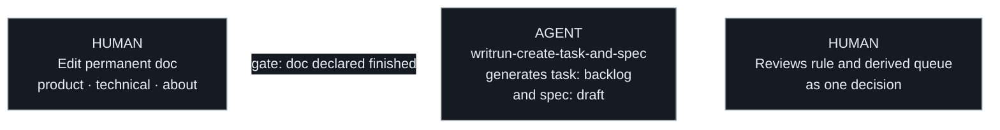
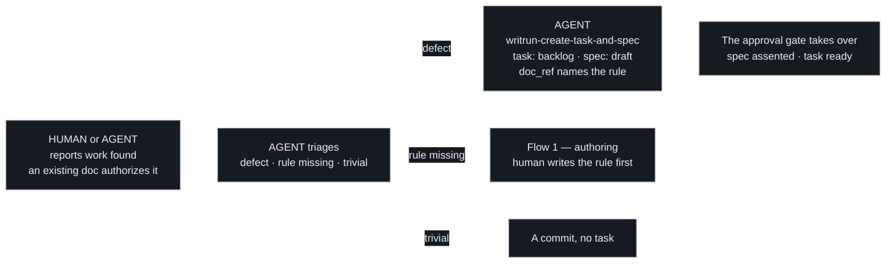

# Authoring: how a rule enters the docs

## Flow 1 — Authoring

A rule is written before anything implements it. **The human writes the rule
and nothing else** — the tasks and specs it derives are generated.
Everything below the rule is derived, which is the whole claim this
methodology makes.

One thing no event can detect is that the rule is *finished*. A human writes
a rule over many edits and nothing distinguishes the last one, so the
handoff is an explicit signal, not an inference: invoking
`writrun-create-task-and-spec` is the human declaring the doc done. A
forgotten handoff is part of the doc review itself: a permanent-doc
change that neither names the tasks it derives nor declares "Derived
work: none" is not reviewable as one decision, and does not stand.

From Stage 2 up, the same flow rides the forge: the branch and the PR
are opened for the derived work, marking the authoring PR ready for
review also carries the handoff declaration, `writrun check` fails a PR
that forgot it, and the mirroring Issue appears on its own — drawn in
[the Stage 2 chapter](../stage-2-pull-requests/README.md).

## Two ways a permanent doc changes

A permanent doc changes at two points in the loop, and they are not the
same act. Confusing them is how a project ends up either unable to write
down a decision it has just made, or shipping behaviour its docs never
mention.

- **Authoring** (step 1) — someone decides a rule that is not yet true
  anywhere and writes it down. The doc is the input: the work to satisfy it
  derives *from* the doc, and no task precedes the change. This is the only
  point where a permanent doc moves ahead of the system it describes.
- **Loop closure** (step 5) — a completed task updates the doc it derived
  from, in the same change that ships the behaviour, bounded by its spec's
  **Proposed changes** contract.

What separates them is direction, not size. Authoring states something the
system does not do yet; loop closure records something it now does. A single
change that tries to be both — closing the loop on one rule while quietly
introducing another — is two changes, and is split into two.

**Authoring closes the loop in advance, and the derived task must not close
it twice.** A task that exists because a rule was authored is there to bring
the code up to a doc that already states the rule. Its spec's **Proposed
product changes** is legitimately "none" — not an omission, and not a gap in
the contract: the doc was updated first, which is what authoring *is*. Loop
closure is for the other kind of task, the one that originated in the code
or the machinery, where no doc has said yet what the system now does. An
agent that "helpfully" re-edits a chapter the authoring change already wrote
is re-deciding a rule it was given, and the delta check will reject the
change as undeclared.

**Both modes leave the doc in the present tense.** A permanent doc is never
a plan and never a changelog, in either direction. Authoring writes the rule
as a rule, not as an intention: the doc says what the system does, and the
[task queue](../concepts/task.md) is what records that the system has not
caught up yet. That separation is the whole reason a doc can lead
implementation without becoming a roadmap — the gap lives in the queue,
where it is tracked and closed, rather than in the prose, where it would
quietly become permanent.

Neither mode is exempt from review: a permanent doc never merges on agent
approval alone, whichever direction it changed in.

## Declaring derived work

An authoring change names every task and spec derived from it, in the
change itself.

Approving a rule is approving the work that rule commits the project to. A
reviewer shown only the new prose is being asked to decide half of
something — the sentence is cheap to agree with, and the queue it creates is
where the cost actually lands. Naming both in one place is what makes the
decision reviewable as one decision.

An authoring change that derives no work — a clarification, a rewording, a
rule the system already satisfies — states that explicitly. An empty
declaration and a forgotten one look identical otherwise.

The declaration is what was known at review time, not a closed set. Work
discovered later is reported normally, against the rule it derives from;
the list is not a claim that nothing else will follow.

## Reporting — work found or reported mid-flight

Not every task descends from a fresh rule. A bug someone hits, a gap an
agent finds in the code or the machinery — work already authorized by a
doc that exists — is **reported**: a change that only adds task and
spec, touches no permanent doc, and implements nothing. The third kind
of change, next to authoring and implementing (`AGENTS.md`).

**The trigger and the authorization are different things.** What makes
the task exist *now* is the report — a person saying "the checkout
returns 500", an agent noticing a script violates a criterion. What
makes the work *legitimate* is, as always, a doc — here one that
already stands: the task points back at it through `doc_ref`. The doc
does not generate a reported task; it validates it.

Triage is the agent's work, and it asks one question — *is what
"correct" means already written, or does a human need to decide it?*

| The report | The route |
|---|---|
| A real defect — a broken screen, a 500, documented behaviour gone | A task, directly. The defect violates the doc of the feature itself; `doc_ref` names it — or stays `null` when the broken feature was never documented, with the evidence in the task body. |
| A behavioural disagreement — "shouldn't it do X instead?" | **Authoring.** No doc states the rule, so fixing means deciding it — the agent stops and hands the pen back; the rule is written first and the task derives from it. |
| A trivial fix — a typo, an obvious one-liner | A commit, never a task (principle 6). |

**A report is checked against the queue before it becomes a task.**
The same defect reported twice — by two people, or by one person and
an agent — is one piece of work, not two: triage starts by reading the
non-completed tasks, and a report that matches one ends there, naming
the existing task rather than minting a double. New evidence the
second report carried enriches the existing task's body, through a
normal queue change.

**An outage inverts the order, never the obligation.** When documented
behaviour is down and users are hurting, the fix does not wait for the
queue: it ships first, through an ordinary branch and PR, at whatever
size the outage demands. The report follows immediately behind it and
runs the normal triage over **what remains** — the proper fix behind
the patch, the missing test, the doc gap. The patch itself gets no
retroactive task: the queue tracks what is pending, and git already
records what happened.

From Stage 2 up, reporting rides a branch whose prefix is `report/` on
purpose — carrying no task id, because a reporting PR records work, it
is not working it, and must not read as in flight — and flow 2 takes
over at the merge
([the Stage 2 chapter](../stage-2-pull-requests/README.md)).

## Criteria

- When a rule is authored into a permanent doc, the change shall not
  require a task to precede it.
- When a rule is being authored, no task or spec shall be derived from it
  until a human has declared the rule finished.
- When a permanent doc is authored ahead of the system it describes, the
  doc shall state the rule in the present tense, and the gap shall be
  recorded as a task rather than as prose in the doc.
- When a change authors a rule into a permanent doc, that change shall name
  every task and spec derived from it, or state explicitly that none were.
- When a change would both close the loop on one rule and author another,
  it shall be split into two changes.
- When a task completes, its diff shall touch every path listed in its
  spec's Proposed-changes sections in the same change, and shall not touch
  a permanent doc that isn't listed there.
- When work is reported and a permanent doc already states the behaviour
  it violates, the task shall be created directly, with `doc_ref` naming
  that doc — no new rule and no doc edit shall be required first.
- When a report asks for behaviour no permanent doc states, the agent
  shall stop and route it through authoring rather than decide the rule
  itself.
- When a reported fix is trivial, it shall be a commit, not a task.
- When a report matches a non-completed task already in the queue, the
  agent shall name that task instead of creating a second one, and new
  evidence shall enrich the existing task's body.
- When documented behaviour is down, the fix shall ship first and the
  report shall follow immediately, triaging what remains; the shipped
  patch itself shall not receive a retroactive task.
