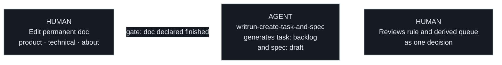
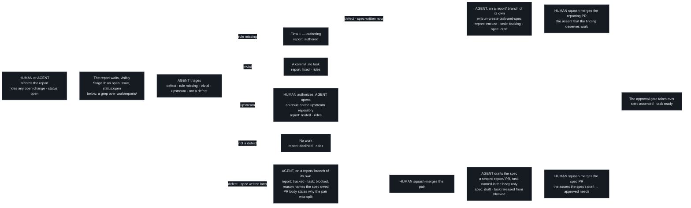

# Authoring: how a rule enters the docs

## Flow 1 — Authoring

A rule is written before anything implements it. **The human writes the rule
and nothing else** — the tasks and specs it derives are generated.
Everything below the rule is derived, which is the whole claim this
methodology makes.

One thing no event can detect is that the rule is *finished*. A human writes
a rule over many edits and nothing distinguishes the last one, so the
handoff is an explicit signal, not an inference: invoking
`writrun-create-task-and-spec` is the human declaring the doc done. A
forgotten handoff is part of the doc review itself: a permanent-doc
change that neither names the tasks it derives nor declares "Derived
work: none" is not reviewable as one decision, and does not stand.

From Stage 2 up, the same flow rides the forge: the branch and the PR
are opened for the derived work, marking the authoring PR ready for
review also carries the handoff declaration, `writrun check` fails a PR
that forgot it, and the mirroring Issue appears on its own — drawn in
[the Stage 2 chapter](../stage-2-pull-requests/README.md).

## Two ways a permanent doc changes

A permanent doc changes at two points in the loop, and they are not the
same act. Confusing them is how a project ends up either unable to write
down a decision it has just made, or shipping behaviour its docs never
mention.

- **Authoring** (step 1) — someone decides a rule that is not yet true
  anywhere and writes it down. The doc is the input: the work to satisfy it
  derives *from* the doc, and no task precedes the change. This is the only
  point where a permanent doc moves ahead of the system it describes.
- **Loop closure** (step 5) — a completed task updates the doc it derived
  from, in the same change that ships the behaviour, bounded by its spec's
  **Proposed changes** contract.

What separates them is direction, not size. Authoring states something the
system does not do yet; loop closure records something it now does. A single
change that tries to be both — closing the loop on one rule while quietly
introducing another — is two changes, and is split into two.

**Authoring closes the loop in advance, and the derived task must not close
it twice.** A task that exists because a rule was authored is there to bring
the code up to a doc that already states the rule. Its spec's **Proposed
product changes** is legitimately "none" — not an omission, and not a gap in
the contract: the doc was updated first, which is what authoring *is*. Loop
closure is for the other kind of task, the one that originated in the code
or the machinery, where no doc has said yet what the system now does. An
agent that "helpfully" re-edits a chapter the authoring change already wrote
is re-deciding a rule it was given, and the delta check will reject the
change as undeclared.

**Both modes leave the doc in the present tense.** A permanent doc is never
a plan and never a changelog, in either direction. Authoring writes the rule
as a rule, not as an intention: the doc says what the system does, and the
[task queue](../concepts/task.md) is what records that the system has not
caught up yet. That separation is the whole reason a doc can lead
implementation without becoming a roadmap — the gap lives in the queue,
where it is tracked and closed, rather than in the prose, where it would
quietly become permanent.

Neither mode is exempt from review: a permanent doc never merges on agent
approval alone, whichever direction it changed in.

## Declaring derived work

An authoring change names every task and spec derived from it, in the
change itself.

Approving a rule is approving the work that rule commits the project to. A
reviewer shown only the new prose is being asked to decide half of
something — the sentence is cheap to agree with, and the queue it creates is
where the cost actually lands. Naming both in one place is what makes the
decision reviewable as one decision.

An authoring change that derives no work — a clarification, a rewording, a
rule the system already satisfies — states that explicitly. An empty
declaration and a forgotten one look identical otherwise.

The declaration is what was known at review time, not a closed set. Work
discovered later is reported normally, against the rule it derives from;
the list is not a claim that nothing else will follow.

## Reporting — work found or reported mid-flight

Not every task descends from a fresh rule. A bug someone hits, a gap an
agent finds in the code or the machinery — work already authorized by a
doc that exists — is **reported**.

**The report is written down first, and kept.** It becomes a file in
[`work/reports/`](../../../work/reports/README.md) with `status: open`,
before anyone decides what to do with it: capture has to cost nothing,
or the small findings that arrive mid-flight go back to being lost in a
conversation ([report](../concepts/report.md)). Recording one **rides
whatever change is already open** — a report is neither a rule nor
work, so the one-kind-per-change rule does not reach it.

At Stage 2+ a change that is *only* recording — the report, plus the
task and spec triage produced from it, in one change or in two (below)
— touches no permanent doc and implements nothing. That is the third kind of change, next to authoring
and implementing (`AGENTS.md`) — and for the `tracked` route it is the
**only** vehicle: a task derived from a report lands through a
`report/` branch of its own, never riding a change that is about
something else
([report](../concepts/report.md#recording-rides-any-change--routing-to-the-queue-does-not)).

**The trigger and the authorization are different things.** What makes
the task exist *now* is the report — a person saying "the checkout
returns 500", an agent noticing a script violates a criterion. What
makes the work *legitimate* is, as always, a doc — here one that
already stands: the task points back at it through `doc_ref`. The doc
does not generate a reported task; it validates it.

Triage is the agent's work, and it asks two questions in order. First,
*is this worth acting on at all?* — the cheap bar the report was let
through on is not the bar for spending work, and a "no" here is a real
answer, not a failure to reach one. Then, for everything that survives:
*is what "correct" means already written, or does a human need to decide
it?*

**Triage ends the report**, and the status it writes is which row it
landed on — that is the whole record, and nothing else keeps it.

| The report | The route | Report ends |
|---|---|---|
| A real defect — a broken screen, a 500, documented behaviour gone | A task, through a reporting pull request of its own: the `report/` branch presents the report, the task and the spec together by default (below), and the maintainer's merge is the assent that the finding deserves the work. The defect violates the doc of the feature itself; `doc_ref` names it — or stays `null` when the broken feature was never documented, with the evidence in the report body. | `tracked` |
| A behavioural disagreement — "shouldn't it do X instead?" | **Authoring.** No doc states the rule, so fixing means deciding it — the agent stops and hands the pen back; the rule is written first and the task derives from it. | `authored` |
| A trivial fix — a typo, an obvious one-liner | A commit, never a task (principle 6). | `fixed` |
| A defect of something this project consumes — the methodology, its kit | **Upstream.** On the user's explicit authorization, an issue on the upstream repository carries the observation ([report](../concepts/report.md#routing-upstream)); the local queue gains nothing. A refused ask leaves the report `open`. | `routed` |
| Not a defect at all, or not worth acting on | Nothing. The body says why, which is the part worth keeping. | `declined` |

**The spec may land after its task.** Together is the default: one
merge assents to the finding, the work and its shape at once.

**Splitting the pair is the author's call, and the pull request states
why it was taken.** When one merge would assent to more than a reviewer
can weigh at once is a judgement, and no line count or delta count
turns it into a threshold. So the rule asks for the reason rather than
a measurement: what a reviewer checks is *was a reason given*, which
has an answer, never *was it big enough*, which never will.

**The task is held `blocked` while its spec is in flight.** The pair
lands with `spec_ref: []`, `status: blocked`, and a `blocked_reason`
naming the spec still owed. Without the hold it lands `ready` and is
fully selectable: a task referencing no spec passes the approval filter
by construction
([selection](../../technical/selection/algorithm.md#task-selection-algorithm)).
An agent taking it would implement against a brief no spec has bounded,
and meet the spec's **Proposed changes** at the completion gate binding
a diff the work never targeted. What unblocks the task is a spec nobody
has written yet — outside the queue entirely, which is `blocked`'s case
and never `depends_on`'s
([task](../concepts/task.md#blocked-vs-depends_on)). A task that
warrants no spec at all is untouched by this — nothing is owed, so
nothing holds it.

The spec is then drafted in a pull request of its own, on a `report/`
branch, stating the spec it drafts. **That pull request names its task
in the body alone** — never as a `[TASK-NNNN]` title tag and never in
the branch name. Both are read as work in flight, and the machinery
believes them; this pull request drafts a plan and works nothing, which
is what the `report/` prefix already says. Its merge approves the spec,
appends the id to the task's `spec_ref`, and releases the task from
`blocked` in the same change — and that merge is the assent the spec's
`draft → approved` transition requires ([gates](gates.md)).

Recording and routing are **two moments, deliberately apart**. The
report rides whatever change is open and lands `open`; from there it
waits where somebody will see it — at Stage 3 an open Issue wearing
`status:open`, below that a `grep` over `work/reports/`. Triage happens
when someone picks it up, and the one route that creates work — the
defect row — travels through a reporting pull request of its own, where
the human's merge is the judgement that the finding deserves the work.
The other four routes end the report in place, and may ride exactly as
the recording did.

**A report is checked against the queue before it becomes a task.**
The same defect reported twice — by two people, or by one person and
an agent — is one piece of work, not two: triage starts by reading the
non-completed tasks, and a report that matches one ends `tracked`
against the existing task rather than minting a double. The duplicate
report is kept, not deleted: two people hitting the same thing is
evidence about the thing. New evidence the
second report carried enriches the existing task's body, through a
normal queue change.

**An outage inverts the order, never the obligation.** When documented
behaviour is down and users are hurting, the fix does not wait for the
queue: it ships first, through an ordinary branch and PR, at whatever
size the outage demands. This is the one case where recording follows
instead of leading — the rule that a report is written before triage
answers "capture must cost nothing", and nothing about it is worth a
minute of an outage. The report follows immediately behind the patch and
runs the normal triage over **what remains** — the proper fix behind the
patch, the missing test, the doc gap. It ends `tracked` when something
remains — through its own reporting pull request, as every `tracked`
does; the urgency was the patch's, not the queue's — and `fixed` when
the patch was the whole of it, and it is
recorded either way: an outage nobody wrote down is the finding most
worth keeping. The patch itself gets no retroactive task: the queue
tracks what is pending, and git already records what happened.

From Stage 2 up, a change that is *only* reporting rides a branch whose
prefix is `report/` on purpose — carrying no task id, because such a PR
records work, it is not working it, and must not read as in flight — and
flow 2 takes over at the merge
([the Stage 2 chapter](../stage-2-pull-requests/README.md)). **That
prefix is for the change that carries queue files and nothing else** —
the report and the pair together, or, where the spec lands later, the
pair and then that spec on its own. A report added
alongside other work needs no branch of its own, which is the exemption
above seen from the forge side: requiring the prefix in every case would
put back exactly the cost the exemption exists to remove.

## Criteria

- When a rule is authored into a permanent doc, the change shall not
  require a task to precede it.
- When a rule is being authored, no task or spec shall be derived from it
  until a human has declared the rule finished.
- When a permanent doc is authored ahead of the system it describes, the
  doc shall state the rule in the present tense, and the gap shall be
  recorded as a task rather than as prose in the doc.
- When a change authors a rule into a permanent doc, that change shall name
  every task and spec derived from it, or state explicitly that none were.
- When a change would both close the loop on one rule and author another,
  it shall be split into two changes.
- When a task completes, its diff shall touch every path listed in its
  spec's Proposed-changes sections in the same change, and shall not touch
  a permanent doc that isn't listed there.
- When work is reported and a permanent doc already states the behaviour
  it violates, the task shall be created directly, with `doc_ref` naming
  that doc — no new rule and no doc edit shall be required first.
- When work is reported, the report shall be recorded as a file before it
  is triaged — except where documented behaviour is down, which inverts
  the order below — and shall be kept whatever route triage takes.
- When a report is triaged, its status shall record which route was
  taken, and shall never restate whether the work it produced is done.
- When a report is recorded, the change carrying it shall not be required
  to carry nothing else, and no `report/` branch shall be required of a
  change that carries other work.
- When triage finds a report not worth acting on, the agent shall decline
  it and record the reason in its body, without escalating to a human.
- When triage finds the defect belongs to a repository this project
  consumes from, the agent shall ask the user's authorization, open an
  issue on that repository stating the observation, and end the report
  `routed` with the issue named in its body.
- When authorization to route upstream is refused or cannot be asked,
  the report shall stay `open`.
- When a report asks for behaviour no permanent doc states, the agent
  shall stop and route it through authoring rather than decide the rule
  itself.
- When a reported fix is trivial, it shall be a commit, not a task.
- When a report matches a non-completed task already in the queue, the
  agent shall name that task instead of creating a second one, and new
  evidence shall enrich the existing task's body.
- When documented behaviour is down, the fix shall ship first and the
  report shall follow immediately, triaging what remains; the report
  shall still be recorded, and the shipped patch itself shall not
  receive a retroactive task.
- When a tracked task's spec is drafted after the task entered the
  queue, the spec shall land through a `report/` pull request of its
  own, and that pull request's merge shall carry the assent the spec's
  `draft → approved` transition requires.
- When the report and its pair land without the spec, the pull request
  body shall state why the pair was split, and the task shall land
  `blocked` with a `blocked_reason` naming the spec still owed.
- When a pull request drafts the spec of a task already in the queue,
  it shall name that task in its body only — never in a `[TASK-NNNN]`
  title tag and never in its branch name — and shall release the task
  from `blocked` in the same change.
