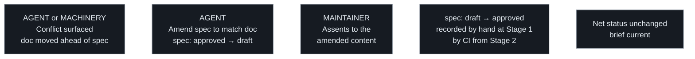
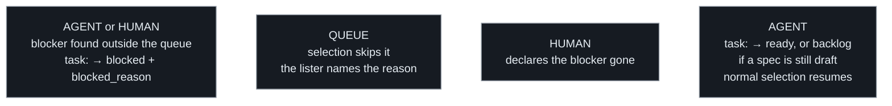

# When things conflict

## A spec changes after its approval

**Content under an approval never changes silently.** An approved spec's
body is what a human assented to; whatever the reason it must change —
usually the doc moved ahead of it (a later authoring change edited a
section it derives from), sometimes the elaboration was simply wrong —
the amendment goes through `draft` and passes the gate again. The doc
always wins over the spec. Two places catch the stale case: the
selection algorithm's step 7 reads the doc against the spec before any
code, and from Stage 2 up CI also names the affected tasks on the
authoring PR itself (`writrun check`, queue impact).

## A task hits an outside blocker

`depends_on` resolves itself; `blocked` never does — it names something
outside the queue, and only a human decision brings the task back.

## When the doc moves ahead of the queue

A task, its spec, and the rule they derive from are approved together —
they start consistent by construction. They stop being consistent one way
only: a **later** authoring change edits a section the queue still
references. That is allowed — the doc is the input and moves first; the
queue is what adjusts. Three consequences, in order:

- **The doc wins.** An approved spec whose premise the doc has since
  changed is no longer authorized work: its approval assented to a brief
  that no longer matches the rule. Implementing the spec as written ships
  code the doc contradicts; quietly "fixing" the work against the doc
  ships something nobody assented to. Neither is the agent's call — stop
  and surface the conflict.
- **The remedy is an amendment, through draft.** The spec is edited to
  reflect the current doc and returns to `draft` in the same change; the
  amended content then passes the same `draft → approved` gate as any
  spec. Editing an approved spec's body while it stays `approved` is
  forbidden — content under an approval never changes silently.
- **Staleness is caught where it is born.** The authoring change that
  moves a doc ahead of the queue is the moment the conflict comes into
  existence, and the reviewer of that change is already looking at the
  rule — so the overlap is surfaced there: a change to a permanent doc
  that non-completed tasks reference names those tasks to its reviewer —
  by whoever presents the change at Stage 1, by the machinery from
  Stage 2 up.

## Criteria

- When an approved spec conflicts with the permanent doc it derives from,
  the agent shall stop and surface the conflict rather than implement
  either side.
- When an approved spec's content needs to change, the change shall return
  it to draft, and the amended spec shall pass the approval gate again.
- When a change edits a permanent doc that a non-completed task
  references, the overlap shall be surfaced to the change's reviewer —
  from Stage 2 up, by the machinery.
