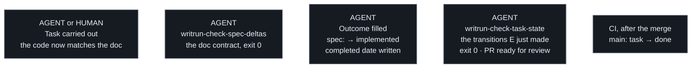

# Flow 4 — Finishing a task

The work itself, then the loop. A task derived from an authored rule exists
to bring the **code up to a doc that already states it** — there is nothing
to update, and its spec promises no product change. A task that originated
elsewhere, in the code or the machinery, carries its doc change with it.

The agent drives the queue mechanics throughout — status, Outcome, the local
checks — because it is what holds the algorithm. **Only the work itself is
delegable.**

The two checks sit on either side of the status change, and that order is
load-bearing. `writrun-check-spec-deltas` verifies the doc contract and can run as
soon as the work is done. `writrun-check-task-state` has nothing to read until the
statuses move — every rule it has is about a transition, so running it first
passes without checking anything.

What the branch moves is the spec's status and the task's `completed`
date — the worker's declaration that the work is finished. The task's
own status line stays untouched: it belongs to the machinery, which
flips it to `done` on the authority branch when the merge lands
carrying that date ([statuses](statuses.md)).

