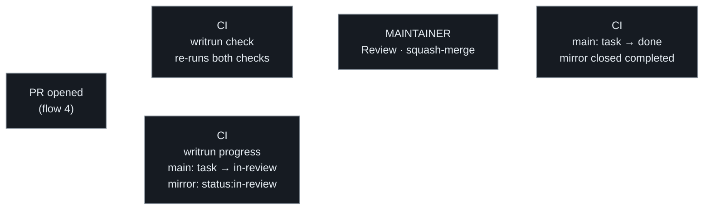
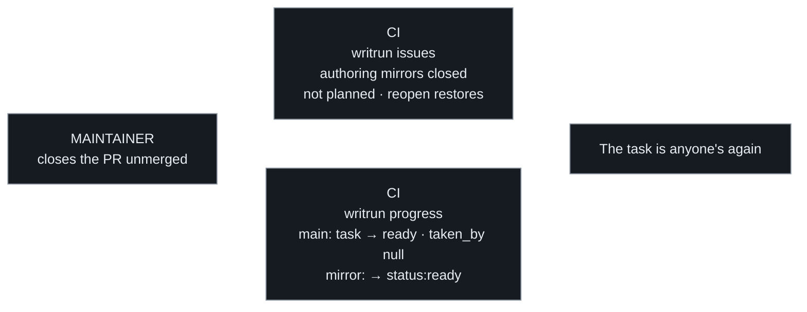

# Flow 5 — Review and merge

Everything after the pull request opens. The maintainer's assent — the
review, or the merge itself, whichever act the project named — is the
decision; CI records around it, the same shape as flow 2.

CI re-runs both checks on the PR. **They verify the methodology, not the
code** — that the diff touched every doc the spec promised and no other,
and that no status moved through a gate it should not have. Whether the
code works is the adopting project's own pipeline's answer; WritRun does
not duplicate it or stand in for it.

Each task the PR carries has the queue on `main` — and its mirror —
follow it: `in-progress` while the PR is still a draft, `in-review` once
it is marked ready, back to `in-progress` when a review requests
changes, `done` once a merge carries the task's `completed` date
([statuses](statuses.md)). **`in-review` is a state of
its own rather than part of `in-progress`** because the two ask opposite
things of the maintainer — one means leave the worker alone, the other
means the maintainer is the blocker.

## The pull request dies

The unhappy half of review: closed without merging. Nothing was
reserved, so nothing entitles anyone — and the machinery unwinds what it
wrote: the task returns to `ready` on `main`, `taken_by` clears, and the
work is anyone's again.

A change belongs to flow 1, to flows 3–5, or to one special flow — never
more than one. One that closes the loop on one rule while introducing
another is two changes.

