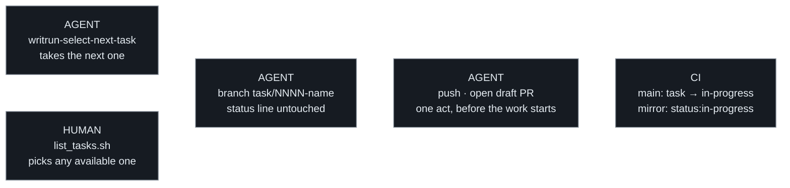

# Flow 3 — Taking a task

Two ways in, same queue. **An agent takes the next task**, by the algorithm,
so repeated sessions agree without re-deriving an answer. **A person lists
what is available and picks** — order is a suggestion for them, and taking a
lower-priority task bypasses nothing. What neither can do is take a task the
filters exclude: `blocked`, a dependency still open, a spec still `draft`.

**Taking a task opens its pull request, as a draft, before the work
starts.** The branch alone is invisible: it lives on one machine, and
until it reaches the forge nothing anywhere says the task is being
worked — the next person to ask what is available is handed work
already under way. The draft is what closes that window, and the
machinery answers it twice over: the mirror moves to
`status:in-progress` on its own, and the same event is written back
onto the authority branch itself — `main` reads `in-progress` the
moment the draft opens, not at merge
([statuses](statuses.md)). Marking the pull request
ready for review at the end is the same event running the other way,
into `status:in-review`.

**Nothing reserves a task, and that is deliberate.** Reserving work is a
tracker's job, not this methodology's — WritRun's own non-goals say so.
A draft pull request is a signal, never a lock: it reports that work is
under way, and it neither stops nor entitles anyone. The branch itself
never touches the task's status line — the machinery owns it — so what
the queue says is never one worker's claim; it is the forge's record,
unwound the same way it was written when a pull request closes
unmerged. What `list_tasks.sh` still asks the forge for is the window
the machinery has not closed yet: a draft just opened, its recording
commit not yet on `main`. Not a lock, but the one real-time signal a
forge can be asked for — and without network access it says so rather
than reporting a task as free.

**The push and the draft are one act, and the adopter gates it once.**
An adopter who set a conduct flag to `false` is asked before their work
is public — the agent presents the branch, the pull request title and the
body together, and pushes nothing before the word. Gating only the
opening would put the branch on the forge first and ask afterwards,
which is the wrong half of the moment: what a gate on this act exists
to hold is work becoming visible to anyone but its author
([the conduct flags](../../technical/settings.md#the-conduct-flags)).

## Criteria

- When a task is taken, its pull request shall be opened as a draft
  before the work starts, so that no task is under way without a signal
  the forge can be asked for.
- When an implementing branch is named, it shall carry the id of the task
  it works, never of a spec that task elaborates.
- When a task is taken under a conduct flag that gates the push or the
  pull request, the agent shall present the branch, the title and the
  body together and put nothing on the forge before an explicit yes, so
  that the gate holds the whole act rather than its second half.
